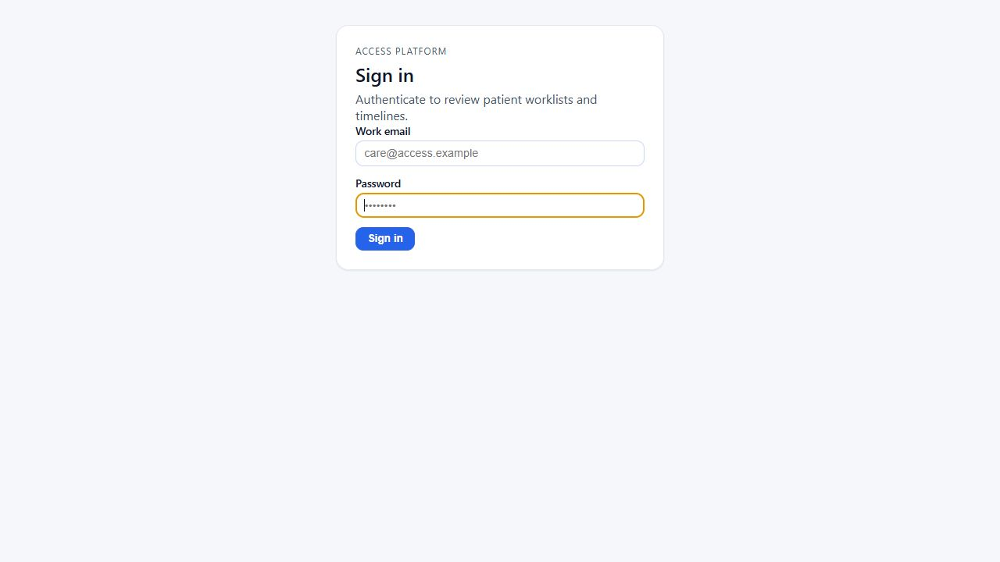
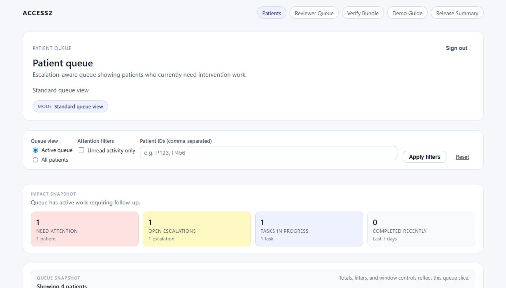
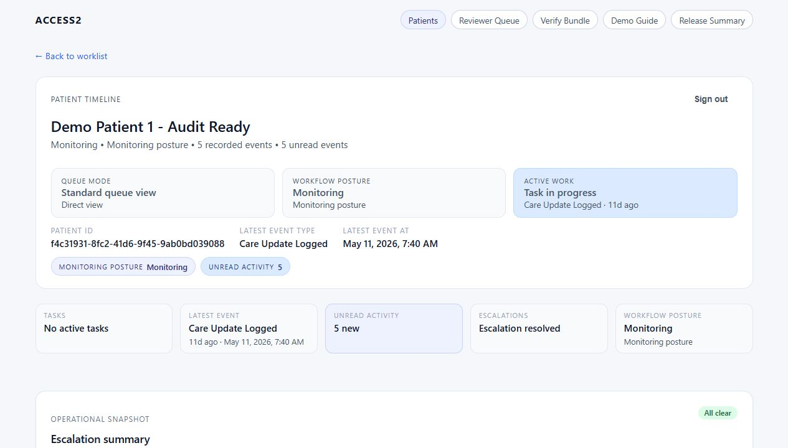
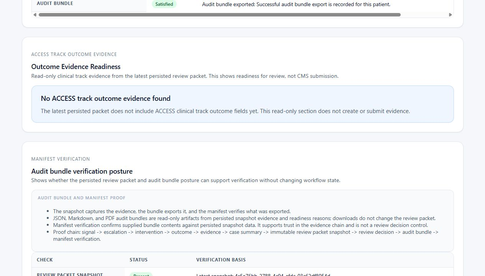
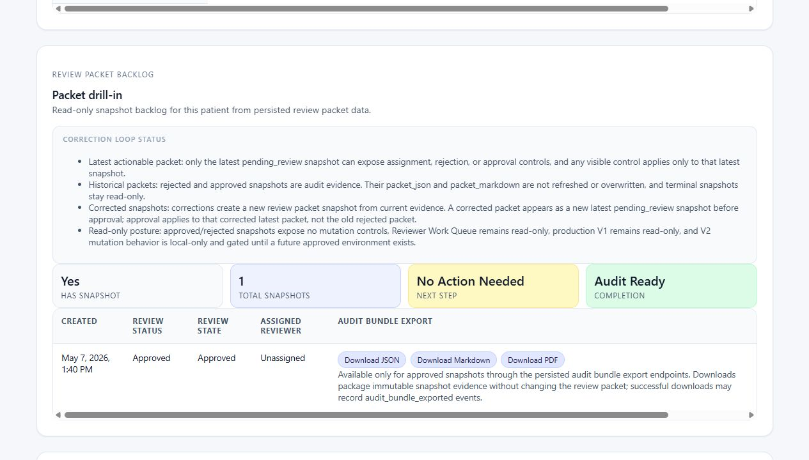
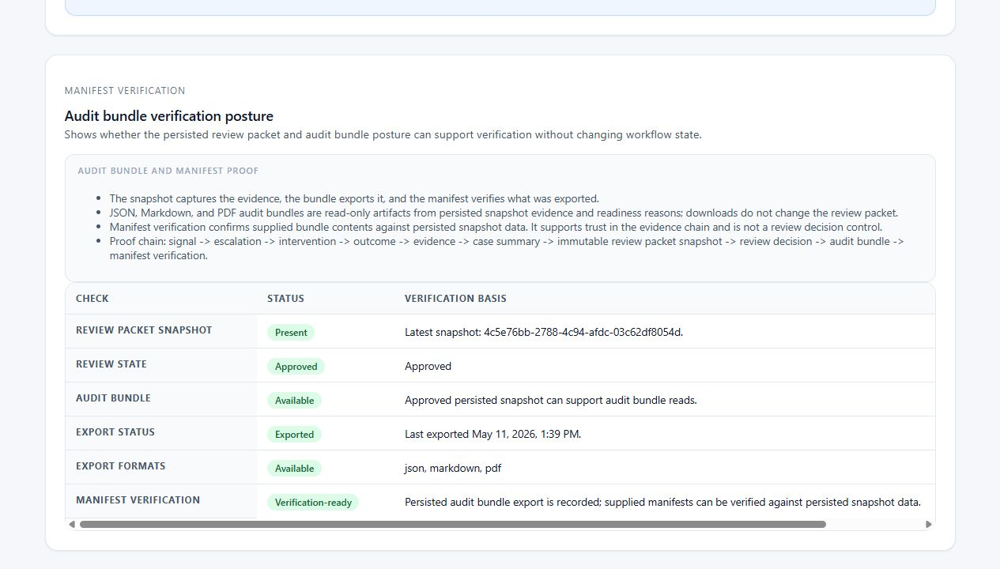
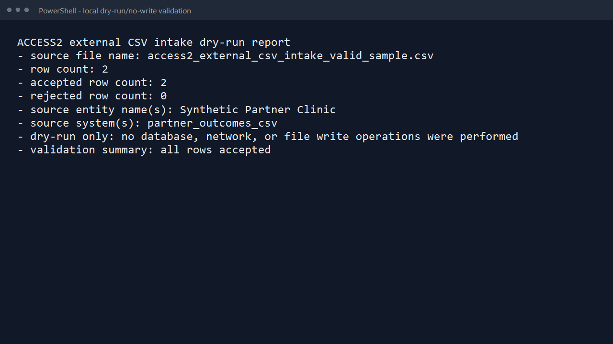

# ACCESS2 July MVP User Guide

Date/checkpoint: May 22, 2026

## Who This Guide Is For

Use this guide for non-technical and mixed stakeholder walkthroughs of the ACCESS2 July MVP.

ACCESS2 is a chronic-care workflow and audit-readiness application aligned to the CMS ACCESS model. The July MVP shows how synthetic chronic-care evidence can move from a patient signal to review and audit-ready evidence while the higher-risk production controls remain gated.

This guide is a user-facing explanation. It is not a product spec, does not authorize new runtime behavior, and does not approve staging or production mutation.

## July MVP Status

- July MVP walkthrough: completed.
- Stakeholder feedback: captured.
- Decision: go for continued July MVP stakeholder walkthrough use.
- Must-fix items: none identified.
- Validation evidence: documented from safe read-only, localhost-only, and local dry-run checks.

## Safety Guardrails

- V1 production remains read-only.
- V2 mutation remains localhost-only.
- Do not run staging or production mutation tests.
- Use synthetic/demo data only.
- Do not enter, paste, import, or discuss real PHI as live patient data.
- Do not use secrets, tokens, cookies, or real credentials in screenshots.
- Do not present ACCESS2 as claims submission, CMS production submission, billing automation, EHR/FHIR integration, AI recommendation, or a full healthcare platform.
- Immutable snapshots and audit bundles must be read from persisted `packet_json` and `packet_markdown` only.
- Do not rebuild immutable packet or audit bundle content on read.
- CSV validation remains local dry-run/no-write.

## What ACCESS2 Does In The July MVP

ACCESS2 shows whether a chronic-care case has enough evidence to support review and audit readiness.

In plain language, the July MVP helps answer:

- Why did this patient need action?
- What escalation or care gap existed?
- What intervention happened?
- What measurable outcome followed?
- Was the care update completed?
- What evidence supports closure?
- What review packet was preserved?
- Was the packet approved or rejected?
- Is the approved evidence ready for an audit bundle handoff?

## The Main Workflow

The ACCESS2 evidence chain is:

```text
signal -> escalation -> intervention -> measurable outcome -> care update -> immutable review packet -> approval/rejection -> audit-ready evidence
```

Each step should make the next step easier to verify. The point is not only to record activity. The point is to prove that an intervention led to a measurable outcome and that the review evidence was preserved.

## Screenshot Guide

Screenshots are stored in:

```text
docs/assets/access2-july-mvp-user-guide/
```

Production screenshots must be read-only. Localhost screenshots may be used only for V2 correction-loop proof. Do not capture staging or production mutation workflows.

## Tester Access Options

Use these options when deciding what a July MVP tester can do.

### 1. External Hands-On Testing

External testers should use production read-only only:

- URL: `https://access2.salvardata.com`
- Test login, navigation, patient detail, Outcome Evidence Readiness, review packet visibility, audit-ready evidence visibility, guide clarity, confusing labels, and read-only behavior.
- Do not test approval, rejection, correction-loop mutation, production writes, staging writes, or any other data-changing action.
- Do not report "cannot access V2 localhost" as a defect. That is expected because V2 exists only on the project owner's local desktop unless the tester has their own local setup.
- Do report confusion if the docs or walkthrough plan do not clearly explain the V2 localhost-only limit.

### 2. Supervised V2 Walkthrough

Use this when a tester needs to see the V2 correction loop but does not have a local ACCESS2 setup.

- The project owner runs localhost V2 on their desktop.
- The tester observes by screen share or approved remote-control session.
- Mutation remains localhost-only.
- Data must remain disposable synthetic/demo data only.
- The tester may review screen clarity, labels, workflow order, and whether the correction-loop story is understandable.

### 3. Independent Local V2 Testing

Independent V2 testing is possible only if the tester has their own local ACCESS2 setup.

- The tester needs Docker/local setup and approved synthetic data.
- The tester must use loopback targets only, such as `localhost` or `127.0.0.1`.
- The tester must not point V2 mutation testing at production, staging, Railway, `https://`, or any non-loopback target.
- A separate local tester setup guide should cover this if independent local V2 testing is needed.

### 4. Future Shared Synthetic V2 Sandbox

A shared synthetic V2 demo sandbox could be created later. It is not part of the current July MVP guardrails.

- Do not assume a shared V2 environment exists.
- Do not run staging or production mutation tests.
- Treat shared sandbox work as a future planning item only.

## V1 Production Read-Only Usage

Use this first for stakeholder walkthroughs.

- Frontend: `https://access2.salvardata.com`
- Data: synthetic demo data only.
- Posture: read-only.
- Do not approve, reject, assign, create snapshots, export new workflow state, or mutate production data.

### Screenshot 1 - Login Screen



Caption: The ACCESS2 login screen for the production read-only walkthrough. Do not expose passwords, tokens, cookies, or session values.

### Screenshot 2 - Dashboard Or Landing Screen



Caption: The first read-only screen after sign-in, used to orient stakeholders to the ACCESS2 demo path.

### Screenshot 3 - Patient Detail Page



Caption: Patient detail shows the synthetic care story, including signal, escalation, intervention, outcome, and review evidence.

### Screenshot 4 - Outcome Evidence Readiness



Caption: Outcome Evidence Readiness is a read-only section from persisted packet evidence. In this production screenshot, the latest persisted packet does not include ACCESS clinical track outcome fields yet, so the section clearly says that no evidence is created or submitted.

### Screenshot 5 - Immutable Review Packet Or Review Summary



Caption: The review packet is preserved as immutable evidence. Reads must use persisted `packet_json` and `packet_markdown`; the packet is not rebuilt during audit reads.

### Screenshot 6 - Audit-Ready Evidence Or Audit Bundle Visibility



Caption: Audit-ready evidence shows that an approved review packet can reach audit bundle posture and manifest verification without changing production workflow state during the read-only walkthrough.

## V2 Localhost-Only Correction-Loop Proof

Use this only when the audience needs to understand the future correction loop.

- Frontend target: `http://localhost:3000` or verified current-workspace `http://localhost:3001`.
- API target: `http://localhost:8000/api/v1`.
- Data: disposable synthetic local demo patient only.
- Posture: localhost-only mutation.
- Do not run this against production, Railway, staging, `https://`, or any non-loopback target.
- External testers cannot open the project owner's localhost V2 directly from their own browser. They can observe by screen share or approved remote-control session.
- V2 correction-loop screenshots or walkthroughs may be observed, but they are not independently testable unless the tester has a local ACCESS2 setup.

The V2 local proof shows that a reviewer can assign, reject with a reason, preserve rejected snapshot history, create a corrected/new immutable snapshot, approve the corrected packet, and reach `audit_bundle.available=true`.

### Screenshot 7 - Localhost Correction-Loop Screen


Caption: Localhost-only V2 access starts on loopback targets. This safe entrypoint image does not show a live mutation workflow. A full correction-loop screenshot should be captured manually only from verified localhost with disposable synthetic data.

## Local CSV Dry-Run Validation

Use this to explain how a synthetic partner outcome file can be checked before any import or persistence exists.

The current validator is local-only and no-write:

- No database writes.
- No database reads.
- No network calls.
- No frontend upload.
- No API endpoint.
- No importer persistence.

PowerShell command shape:

```powershell
cd C:\dev\access2
py -3 backend\scripts\validate_external_csv_intake.py docs\examples\access2_external_csv_intake_valid_sample.csv
```

Expected dry-run evidence:

```text
ACCESS2 external CSV intake dry-run report
- source file name: access2_external_csv_intake_valid_sample.csv
- row count: 2
- accepted row count: 2
- rejected row count: 0
- source entity name(s): Synthetic Partner Clinic
- source system(s): partner_outcomes_csv
- dry-run only: no database, network, or file write operations were performed
- validation summary: all rows accepted
```

### Screenshot 8 - CSV Dry-Run Validation Terminal Output



Caption: The terminal output confirms a local no-write validation of the synthetic CSV fixture with 2 accepted rows and 0 rejected rows.

## What This Does Not Do

The July MVP does not:

- Use real PHI.
- Submit claims.
- Submit to CMS production systems.
- Provide billing workflow or payment reconciliation.
- Provide production mutation workflows.
- Run staging or production mutation tests.
- Provide EHR or FHIR integration.
- Provide AI recommendations or AI-generated care plans.
- Provide a patient portal, provider messaging, or mobile app.
- Replace compliance, security, data-use, staging, or production launch approvals.
- Rebuild immutable packet or audit bundle content during reads.

## Quick Walkthrough Script

Use this plain talk track:

1. ACCESS2 starts with a patient signal or care gap.
2. The signal creates an escalation that needs follow-up.
3. A care team records an intervention.
4. ACCESS2 connects the intervention to a measurable outcome.
5. A care update shows whether the care gap moved toward resolution.
6. The evidence is preserved in an immutable review packet.
7. A reviewer approves or rejects the packet.
8. Approved evidence can support audit-ready bundle posture and verification.

## FAQ And Glossary

**ACCESS2**  
The application that connects chronic-care workflow evidence to review and audit readiness.

**CMS ACCESS model**  
The care model ACCESS2 is aligned to. In this guide, it means the product must show outcome accountability and audit-ready evidence.

**Signal**  
The first sign that a patient may need action, such as a care gap or clinical concern.

**Escalation**  
A flagged need that requires follow-up, intervention, or review.

**Intervention**  
The action taken to address the care need.

**Measurable outcome**  
A result that can be compared against a baseline or expected improvement.

**Care update**  
The documented update showing how the case moved after the intervention.

**Immutable review packet**  
A preserved snapshot of review evidence. It should not be edited, rebuilt, or silently changed after creation.

**Approval/rejection**  
The reviewer decision on whether the packet is ready or needs correction.

**Audit bundle**  
The audit-ready handoff package based on approved persisted evidence.

**CSV dry run**  
A local validation-only check of a synthetic CSV file. It does not write to the database or import data.

## Where To Go Next

- Package entry point: [access2-stakeholder-demo-package-index.md](C:/dev/access2/docs/access2-stakeholder-demo-package-index.md)
- Final rehearsal and go/no-go record: [access2-july-mvp-final-rehearsal-and-go-no-go.md](C:/dev/access2/docs/access2-july-mvp-final-rehearsal-and-go-no-go.md)
- V1 production read-only walkthrough: [access2-v1-demo-day-script.md](C:/dev/access2/docs/access2-v1-demo-day-script.md)
- V2 localhost-only handoff: [access2-v2-local-demo-handoff-index.md](C:/dev/access2/docs/access2-v2-local-demo-handoff-index.md)
- CSV dry-run specification: [access2-external-csv-intake-spec.md](C:/dev/access2/docs/access2-external-csv-intake-spec.md)
