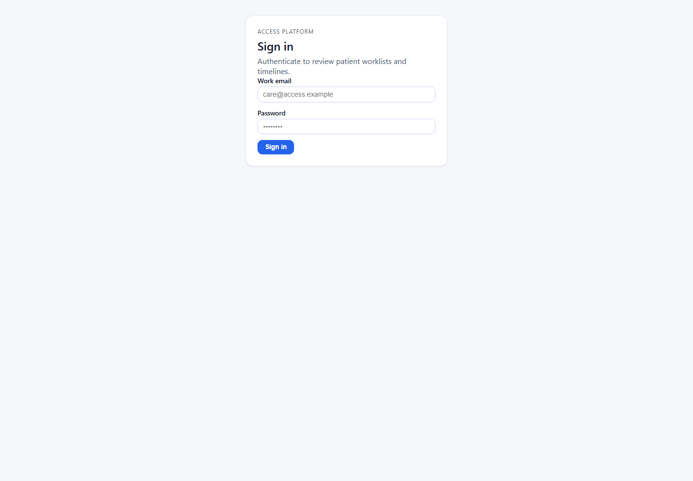
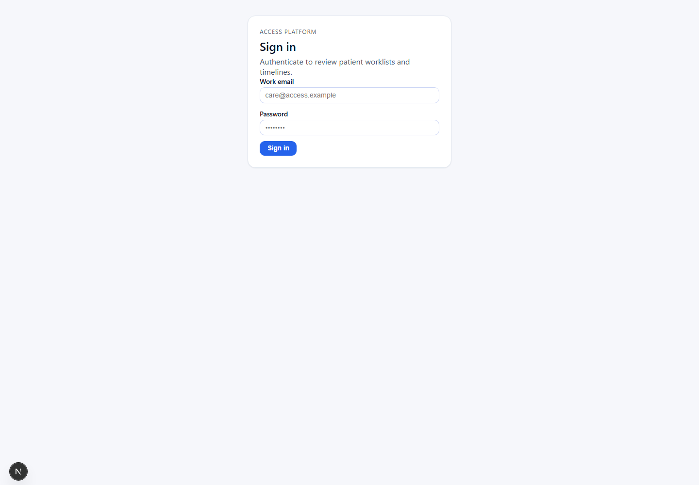

# ACCESS2 Stakeholder Demo Printable Walkthrough

Use this printable guide while presenting ACCESS2 to stakeholders. It combines the current talk track, click path, proof points, screenshots, and safety guardrails without replacing the detailed runbooks.

Primary routing doc: [access2-stakeholder-demo-package-index.md](C:/dev/access2/docs/access2-stakeholder-demo-package-index.md)

Print guidance:

- Print in portrait or export this Markdown to PDF from your editor.
- Keep screenshots scaled to page width.
- If the authenticated screenshots are missing, capture them manually after signing in and place them in `docs/assets/access2-demo-walkthrough/`.
- Do not print passwords, tokens, cookies, session values, or environment variables.

## Demo Safety Guardrails

- Use synthetic/demo data only. Do not enter real PHI.
- V1 production is read-only at `https://access2.salvardata.com`.
- V1 backend API is `https://api.salvardata.com/api/v1`.
- Do not click approve, reject, override, assign, create snapshot, or mutation controls in production.
- Do not run production mutation tests.
- Do not mutate Railway, staging, `salvardata.com`, `api.salvardata.com`, `railway.app`, `up.railway.app`, `https://`, or non-loopback targets.
- V2 correction-loop mutation remains localhost-only.
- V2 allowed local targets are `http://localhost:3000`, verified current-workspace `http://localhost:3001`, and `http://localhost:8000/api/v1`.
- Staging mutation is not approved.
- Do not imply EHR/FHIR, billing, AI recommendations, real CMS submission, or real PHI workflows exist.
- Do not describe rejected snapshots as edited, refreshed, repaired, or overwritten.

## Quick Setup Checklist

- Confirm you are presenting the stakeholder package from [access2-stakeholder-demo-package-index.md](C:/dev/access2/docs/access2-stakeholder-demo-package-index.md).
- Open the V1 production frontend: `https://access2.salvardata.com`.
- Confirm the production walkthrough is read-only.
- Keep the four V1 seeded patient postures handy:
  - Demo Patient 1: audit-ready.
  - Demo Patient 2: missing evidence.
  - Demo Patient 3: rejected review.
  - Demo Patient 4: override-approved review.
- If showing V2, verify localhost frontend and API health first.
- If V2 local is not ready, use the recorded rehearsal result instead of debugging live.

## Recommended Presenter Flow

1. Open with the product purpose.
2. Show V1 production read-only proof first.
3. Walk through Demo Guide, Release Summary, Reviewer Work Queue, patient evidence, audit bundle posture, and manifest verification.
4. Explain the expected production E2E posture: `8 passed, 2 skipped, 0 failed`.
5. If needed, switch to the V2 localhost-only correction-loop story.
6. Close with the stakeholder decision: keep production read-only, collect feedback, or approve isolated staging planning later.

Say:

> ACCESS2 proves chronic-care accountability. It connects the signal, escalation, intervention, outcome, care update, resolution evidence, immutable review packet, review decision, and audit bundle.

## V1 Production Read-Only Walkthrough

### Step 1 - Sign In

Screenshot:

Click path:

- Open `https://access2.salvardata.com`.
- Sign in using the demo credentials already approved for the walkthrough.
- Do not print or expose the password.

What to say:

- "This is the production demo surface."
- "It uses synthetic demo data only."
- "The production walkthrough is read-only."

Proof point:

- A seeded operator can access the ACCESS2 demo application.

Do not click:

- Do not create, approve, reject, assign, override, export, or create snapshots as live production mutations.

### Step 2 - Demo Guide

Screenshot placeholder:

> Manual screenshot needed: after signing in, capture `/demo-guide` as `docs/assets/access2-demo-walkthrough/02-demo-guide.png`.

Click path:

- Open `Demo Guide` or navigate to `/demo-guide`.

What to say:

- "This frames the proof chain and the no-PHI expectation."
- "ACCESS2 is not just tracking tasks; it is preserving evidence for review."

Proof point:

- The demo is framed around signal, escalation, intervention, outcome, evidence, immutable review, and audit readiness.

Do not click:

- Do not follow any path that creates or changes workflow state.

### Step 3 - Release Summary

Screenshot placeholder:

> Manual screenshot needed: after signing in, capture `/demo/release-summary` as `docs/assets/access2-demo-walkthrough/03-demo-release-summary.png`.

Click path:

- Open `Release Summary` or navigate to `/demo/release-summary`.

What to say:

- "This is the operator summary for the current demo posture."
- "The expected production E2E baseline is 8 passed, 2 skipped, and 0 failed."
- "The skips are intentional because production mutation controls remain disabled."

Proof point:

- The four seeded production scenarios can be explained without changing data.

Do not click:

- Do not look for production approve, reject, override, assign, export, or create-snapshot controls on this read-only page.

### Step 4 - Reviewer Work Queue

Screenshot placeholder:

> Manual screenshot needed: after signing in, capture `/audit-readiness` as `docs/assets/access2-demo-walkthrough/04-reviewer-work-queue.png`.

Click path:

- Open `Reviewer Queue` or navigate to `/audit-readiness`.

What to say:

- "The Reviewer Work Queue is a read-only navigation and posture surface in V1."
- "It shows what is ready, blocked, rejected, override-approved, pending, or exported without changing the audit record."

Proof point:

- Review packet posture is visible while production mutation remains disabled.

Do not click:

- Do not attempt reviewer assignment, rejection, approval, override approval, export mutation, or snapshot creation.

### Step 5 - Audit-Ready Patient And Audit Bundle Posture

Screenshot placeholder:

> Manual screenshot needed: capture Demo Patient 1 patient detail as `docs/assets/access2-demo-walkthrough/05-patient-approved-audit-bundle.png`.

Click path:

- From the queue or release summary, open Demo Patient 1, the audit-ready scenario.
- Show the review-packet backlog and approved audit bundle posture.

What to say:

- "This patient demonstrates the full read-only audit-ready posture."
- "The approved snapshot is immutable and audit-bundle-ready."

Proof point:

- The app can show an approved/export-ready packet without rebuilding old snapshot content during reads.

Do not click:

- Do not perform a fresh production export or any mutation action during the walkthrough.

### Step 6 - Evidence Chain

Screenshot placeholder:

> Manual screenshot needed: capture the patient Evidence Chain panel as `docs/assets/access2-demo-walkthrough/06-evidence-chain.png`.

Click path:

- Stay on Demo Patient 1.
- Scroll to the evidence chain and proof panels.

What to say:

- "The evidence chain answers what happened, what changed, and what supports that change."
- "Workflow activity alone is not enough; ACCESS2 is looking for outcome proof."

Proof point:

- Patient-level evidence links the chronic-care signal to intervention, outcome, and review readiness.

Do not click:

- Do not edit evidence or add new outcome data in production.

### Step 7 - Manifest Verification

Screenshot placeholder:

> Manual screenshot needed: capture `/audit-bundle-verify` as `docs/assets/access2-demo-walkthrough/07-manifest-verification.png`.

Click path:

- Open `Verify Bundle` or navigate to `/audit-bundle-verify`.
- Explain verification using an already exported JSON bundle manifest.

What to say:

- "The manifest verifies the exported bundle against persisted snapshot data."
- "Verification protects against treating a stale or mismatched bundle as valid."

Proof point:

- ACCESS2 can verify audit artifacts against persisted review-packet evidence.

Do not click:

- Do not paste secrets, tokens, cookies, or real PHI into the verifier.

## V2 Localhost-Only Correction-Loop Walkthrough

### V2 Setup Posture

Screenshot:

If running the live V2 local demo, verify:

- Frontend is `http://localhost:3000` or verified current-workspace `http://localhost:3001`.
- API is `http://localhost:8000/api/v1`.
- Backend health passes:
  - `/health/live`
  - `/health/ready`
- Disposable local patient starts with latest `pending_review`, or run the documented local seed/reset only with `ACCESS2_ENABLE_LOCAL_MUTATION_E2E=true`.

What to say:

- "This part is local-only. Production V1 remains read-only."
- "The purpose is to show correction without rewriting history."

Do not click:

- Do not run this against production, Railway, staging, `https://`, or any non-loopback host.

### V2 Live Sequence

Screenshot placeholder:

> Manual screenshot needed only if the local V2 app is running and safe: capture the correction-loop patient detail as `docs/assets/access2-demo-walkthrough/08-v2-local-correction-loop.png`.

Click path:

1. Open the verified localhost frontend.
2. Log in to the local demo environment.
3. Open the disposable local V2 demo patient.
4. Show the latest `pending_review` packet posture.
5. Assign reviewer.
6. Reject the latest pending snapshot with a demo-safe reason.
7. Show the rejected snapshot is terminal and read-only.
8. Create a corrected/new review packet snapshot.
9. Approve the corrected latest snapshot.
10. Show `audit_bundle.available=true`.
11. Show the prior rejected snapshot remains in backlog/history.

What to say:

- "The reviewer is not editing the old snapshot; they are making a decision on an immutable packet."
- "A rejection does not overwrite the evidence trail."
- "The correction creates a new packet from the current corrected case state."
- "The prior rejected snapshot remains part of the audit history."
- "Approval is only allowed when the persisted checklist has no missing evidence."

Proof point:

- ACCESS2 can support a correction loop while preserving immutable rejected packet history.

Do not click:

- Do not use non-loopback targets.
- Do not use real PHI.
- Do not run staging, Railway, or production mutation E2E.
- Do not describe the rejected packet as repaired or overwritten.

If V2 local is not run live, say:

> The latest recorded localhost rehearsal passed with `1 passed (10.6m)` and verified assignment, rejection, corrected snapshot creation, approval, `audit_bundle.available=true`, terminal read-only snapshots, and preserved rejected history.

## Stakeholder Decision Close

Say:

> The current release posture is deliberate. V1 production safely explains and verifies the audit evidence chain in a read-only posture. V2 localhost proves the next correction-loop mutation pattern on disposable local data. Staging comes only after isolated infrastructure, synthetic data, reset ownership, and fail-closed host guards are explicitly approved.

Decision options:

- Keep V1 production as the external read-only demo and collect feedback.
- Use the printable guide for another stakeholder rehearsal.
- Package feedback into a small docs/copy clarity slice.
- Begin isolated staging planning only after separate staging or preview infrastructure is explicitly approved.

## Troubleshooting And Fallback Notes

- If production is slow: pause on the current page and continue the talk track from this guide.
- If login is unavailable: do not troubleshoot live; switch to the printed screenshots and explain the expected read-only path.
- If an authenticated screenshot is missing: use the placeholder and capture it manually after the meeting.
- If local Next.js is compiling: say the local dev server is warming routes and continue with the recorded rehearsal result.
- If port `3000` is stale: use only a verified current-workspace loopback frontend on `3001`.
- If browser tooling fails with `EPERM` or permission errors: stop the live UI path and use the recorded local rehearsal result.
- If V2 local patient is already terminal-approved: reset only through the documented local gated seed/reset path.

## Appendix

Exact URLs:

- V1 production frontend: `https://access2.salvardata.com`
- V1 production API: `https://api.salvardata.com/api/v1`
- V1 Demo Guide: `https://access2.salvardata.com/demo-guide`
- V1 Release Summary: `https://access2.salvardata.com/demo/release-summary`
- V1 Reviewer Work Queue: `https://access2.salvardata.com/audit-readiness`
- V1 Manifest Verification: `https://access2.salvardata.com/audit-bundle-verify`
- V2 local frontend: `http://localhost:3000` or verified `http://localhost:3001`
- V2 local API: `http://localhost:8000/api/v1`

Expected E2E posture:

- Production V1: `8 passed, 2 skipped, 0 failed`.
- Expected production skips:
  - Demo Patient 3 reviewer rejection through UI.
  - Demo Patient 4 superuser override approval through UI.
- V2 localhost rehearsal: `npm run test:e2e:local-mutation`, `1 passed (10.6m)`.

Manual screenshot checklist:

- `02-demo-guide.png`: authenticated V1 Demo Guide.
- `03-demo-release-summary.png`: authenticated V1 Release Summary.
- `04-reviewer-work-queue.png`: authenticated Reviewer Work Queue.
- `05-patient-approved-audit-bundle.png`: Demo Patient 1 approved audit bundle posture.
- `06-evidence-chain.png`: Demo Patient 1 evidence chain.
- `07-manifest-verification.png`: Manifest Verification page.
- `08-v2-local-correction-loop.png`: optional localhost-only V2 correction-loop patient detail.

Reference docs:

- [access2-stakeholder-demo-package-index.md](C:/dev/access2/docs/access2-stakeholder-demo-package-index.md)
- [access2-product-release-positioning.md](C:/dev/access2/docs/access2-product-release-positioning.md)
- [access2-v1-demo-day-script.md](C:/dev/access2/docs/access2-v1-demo-day-script.md)
- [access2-v1-demo-handoff-summary.md](C:/dev/access2/docs/access2-v1-demo-handoff-summary.md)
- [access2-v2-local-demo-handoff-index.md](C:/dev/access2/docs/access2-v2-local-demo-handoff-index.md)
- [access2-v2-local-demo-operator-script.md](C:/dev/access2/docs/access2-v2-local-demo-operator-script.md)
